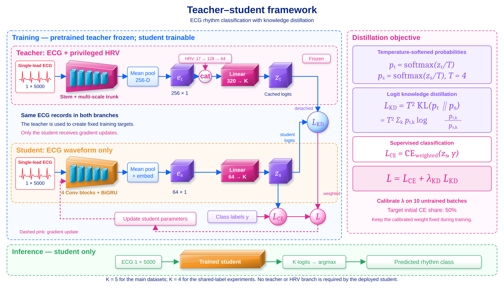

# Lightweight ECG Rhythm Classification by Knowledge Distillation

**EEE 402 — Artificial Intelligence and Machine Learning Laboratory, BUET (2026)**
Section G2 · Group 02 — Affan Sabith (2106115) · Reshad Ibtesam Nibir (2106137) · Hasan Mamun (2106127)
Course instructors: Tanvir Hossain (Lecturer), Anindya Bhattacharjee (Adjunct Lecturer)

A 1.82 M-parameter multi-scale CNN **teacher** (with a training-only HRV branch) is distilled into a
**54,709-parameter CNN–BiGRU student** that reads a raw 10-second single-lead ECG and predicts its rhythm class.
The student is **33.2× smaller**, runs in **3.15 ms per ECG on a CPU**, has a **0.23 MB** model file, and stays
within **0.6–0.9 accuracy points** of the teacher.



---

## Results

5-fold cross-validation × 5 seeds (teacher: 5 folds), no epoch selection.

| Model | Parameters | Chapman acc / macro-F1 (%) | Ningbo acc / macro-F1 (%) |
|---|---:|---:|---:|
| Teacher (ours) | 1,817,373 | 98.29 / 97.13 | **97.14 / 96.00** |
| **Student (ours, CE + KD)** | **54,709** | 97.72 / 96.22 | 96.27 / 94.43 |
| EXGnet (published) | 8.26 M | 98.76 / 97.91 | 96.93 / 95.53 |
| G2-ResNeXt (published) | 4.37 M | 98.39 / 97.27 | 96.68 / 94.93 |

Zero-shot transfer of the Ningbo-trained student (no retraining), atrial-fibrillation F1: Chapman 98.0,
CPSC-2018 95.7, Georgia (USA) 69.6, MIT-BIH (USA) 59.3 — AF recall stays at 82–97 %, precision drops on US data.

Deployment (laptop): CPU batch 1 — 3.15 ms (teacher 11.36 ms); GPU batch 1 — 1.96 ms; file 0.23 MB (teacher 7.34 MB).

Result files are not included; `run_all.bat` regenerates them in `results/`. Full analysis: [`report/Final_Project_Report_G2_Group02.pdf`](report/Final_Project_Report_G2_Group02.pdf).

---

## Repository layout

```
├── README.md, DATA.md, requirements.txt, LICENSE
├── paths.py                 every path (override with environment variables)
├── data.py                  loaders: Chapman/Ningbo CSV, CPSC/Georgia parquet, MIT-BIH (WFDB, rhythm level)
├── teacher_v2.py            teacher: parallel k5/k11/k21 multi-scale blocks + SE + HRV branch (trains one fold)
├── export_teacher_v2.py     caches frozen teacher logits once per fold
├── student.py               54,709-parameter student (4 strided convs -> BiGRU -> 64-D embedding)
├── distill.py               distillation losses (the method uses LogitKD, T = 4)
├── train_student.py         trains one student (one fold, one seed); automatic KD weight
├── evaluate_external.py     zero-shot evaluation on CPSC / Georgia / MIT-BIH / Chapman / Ningbo
├── analyze.py, analyze_mitbih.py, benchmark.py, make_all_tables.py
├── run_all.bat, run_pooled.bat   one-command reproduction (Windows / Anaconda Prompt)
├── scripts/
│   ├── predict.py                       classify one ECG with a pretrained student
│   ├── convert_cinc2021_to_parquet.py   build the CPSC/Georgia parquet files from PhysioNet
│   ├── summarize_results.py             results/*.json -> results/summary/*.json (after run_all.bat)
│   └── make_figures.py                  results/summary -> figures/results/*.png
├── checkpoints/   final pretrained weights: one student + one teacher each for Chapman and Ningbo
├── figures/       architecture/ (model diagrams) and results/ (charts)
├── report/        final report (Word + PDF)
├── presentation/  final slides + presenter guide
├── docs/          per-class tables, literature comparison
└── data/          put the datasets here (not included — see DATA.md)
```

`train_student.py` and `distill.py` also contain the other training modes we explored during development
(label-only baseline and feature/relational distillation); the reported method is `--mode kd`.

---

## Quick start

```bash
pip install -r requirements.txt

# classify one ECG (one lead, 500 Hz, 10 s; .npy / .csv / .txt)
python scripts/predict.py --ecg my_ecg.csv
python scripts/predict.py --ecg my_ecg.npy --ckpt checkpoints/student_kd_v2_chapman_without_others_fold4_seed4.pt
```

Ningbo students predict SR, SB, ST, SI, AFIB/AFL; Chapman students predict SR, SB, ST, AFIB/AFL, SVT/AT.
The output is a screening suggestion, **not a medical diagnosis**.

## Reproducing the experiments

1. Download the data and place it as described in [DATA.md](DATA.md).
2. Run everything (Anaconda Prompt, from the repository folder):
   ```
   run_all.bat
   run_pooled.bat
   ```
3. Or one step at a time:
   ```
   python teacher_v2.py --dataset chapman --fold 0
   python export_teacher_v2.py --dataset chapman --fold 0
   python train_student.py --mode kd --dataset chapman --fold 0 --seed 0
   python evaluate_external.py --source chapman --target georgia
   python benchmark.py
   ```
   For Ningbo add `--min_class 100` (drops SVT/AT, which has only 15 records).

Paths can be changed without editing code: `EXGNET_DATA_DIR`, `EXGNET_OUT_DIR`, `EXGNET_MITBIH_DIR`.

### Protocol
- Folds: `KFold(5, shuffle=True, random_state=42)`; seeds 0–4; every comparison is paired over 25 (fold, seed) cells.
- Deterministic cuDNN kernels (otherwise identical runs differed by 0.41 points).
- Fixed 60-epoch cosine schedule, final model kept — no "best epoch" selection (it moved accuracy by 0.98 points).
- KD: `L = CE_w + λ·T²·KL(p_t ‖ p_s)`, `T = 4`; λ set once so cross-entropy is 50 % of the initial loss.
- External databases are evaluated zero-shot; classes are matched by name.

---

## Data

The datasets are public but too large for GitHub (Chapman/Ningbo CSVs ≈ 0.5–1.5 GB each). Download links and
the expected folder layout are in **[DATA.md](DATA.md)**.

## Acknowledgements and licence

Code, models and figures in this repository are our own work. Published results of EXGnet, G2-ResNeXt,
xECGArch and others are cited for comparison only; no code from those works is included.
The ECG databases belong to their creators and are used under their respective licences (see DATA.md).
Code is released under the MIT licence (see `LICENSE`).
